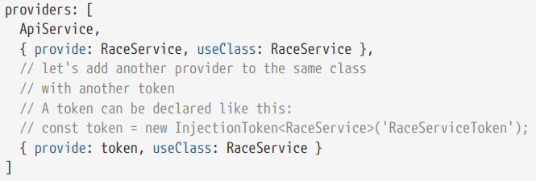
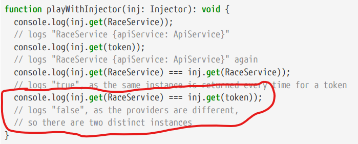
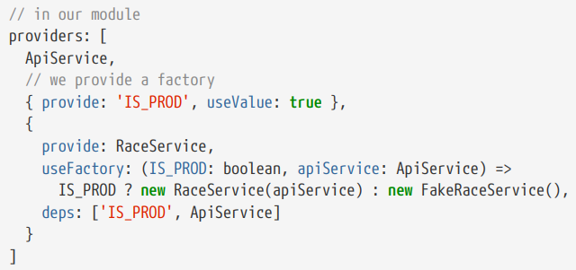
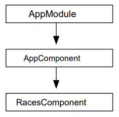
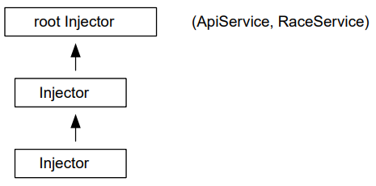

# Dependency injection (DI)

**DI** - это хорошо известный шаблон проектирования.
Примером зависимости может быть **сервис**, необходимый компоненту.
Идея заключается в том, что вместо того, чтобы компонент сам создавал зависимось, зависимость создаётся фреймворком и затем предоставляется компоненту.

Этот приём известен также как **"инверсия контроля"**.

## Особенности:

- **лёгкость разработки**: мы говорим, что мы хотим и где мы хотим это спользовать

- **лёгкость тестирования**: замена зависимостей на моки

- **лёгкость в настройке**: путём переключения между реализациями

## Чтобы использовать **DI** нужно следующее:

- способ регистрации зависимости, чтобы она стала доступной для инъекции в компонент/сервис

- способ объявления того, какая зависимость нужна текущему компоненту/сервису

## Пример

Используя TypeScript, объявить зависимость легко: необходимо просто воспользоваться системой типов.

```ts
@Component({
  selector: "app-notes-list",
  templateUrl: "./notes-list.component.html",
  styleUrls: ["./notes-list.component.css"],
})
export class NotesListComponent implements OnInit {
  public notes!: Array<Note>;

  // объявление зависимости service: NotesService
  public constructor(private readonly service: NotesService) {}

  public ngOnInit(): void {
    this.service.getNotes().subscribe((notes: Array<Note>) => {
      this.notes = notes;
    });
  }
}
```

Angular посмотрит в регистр зависимостей и, если инстанс зависимости существует, вернет его, если нет - создаст его и внедрит в компонент.

Чтобы уведомить Angular, что класс может внедряться (являться зависимостью) необходимо декорировать данный клас декоратором **@Injectable()**

```ts
@Injectable()
export class NotesService {
  public constructor() {}

  public getNotes(): Observable<Array<Note>> {
    return of(notes);
  }
}
```

После этого такой класс нужно **зарегистрировать**, чтобы сделать его доступным для внедрения.

Начиная с Angular 6.0 **простой (и рекомендованный)** способ выглядит следующим образом:

```ts
@Injectable({
  provideIn: 'root',
})
```

Другой способ - используя атрибут **providers** декоратора **@NgModule**

```ts
// Файл notes.service.ts
@Injectable()
export class NotesService {
  public constructor() {}

  public getNotes(): Observable<Array<Note>> {
    return of(notes);
  }
}

// Файл app.module.ts
@NgModule({
  declarations: [AppComponent, NotesListComponent],
  imports: [BrowserModule, AppRoutingModule],
  // Место регистрации зависимости
  providers: [NotesService],
  bootstrap: [AppComponent],
})
export class AppModule {}
```

Более длинная форма регистрации зависимости:

```ts
@NgModule({
  declarations: [AppComponent, NotesListComponent],
  imports: [BrowserModule, AppRoutingModule],
  // Место регистрации зависимости
  providers: [
    {
      provide: NotesService,
      useClass: NotesService,
    },
  ],
  bootstrap: [AppComponent],
})
export class AppModule {}
```

Мы говорим **Injector**, что мы хотим создать связь между **токеном** (в этом случае **типом NotesService**) и **классом NotesService**.

**Injector** - это сервис который, отслеживает внедряемые классы (компоненты) путем ведения реестра и фактически внедряет их, когда это необходимо.

**Реестр** — это карта, которая связывает ключи, называемые **токенами**, с **классами**.

**Токен** - уникальный идентификатор зависимости. Токены не обязательно являются строками, в отличие от многих фреймворков внедрения зависимостей. Они могут быть любыми, например, ссылками на тип. И так обычно и будет.

Этот **Injector** возвращается промисом **bootstrapModule**

```ts
// Файл main.ts
platformBrowserDynamic()
  .bootstrapModule(AppModule)
  .then((appRef) => {
    // Получаем injector
    const injector = appRef.injector;
    // Получаем NotesService через injector
    const notesService = injector.get(NotesService);
    // Пользуемся сервисом
    notesService.getNotes().subscribe((notes) => {
      console.log(notes);
    });
  })
  .catch((err) => console.error(err));
```

Метод **injector.get(token)** принимает в качестве аргумента токен.

> Если мы зарегистрируем 2 одинаковых сервиса под разными токенами, то для каждого токена будет создан отдельный экземпляр сервиса (далее пример из книги)




## Основные моменты

- provider связывает token c service

- injector возвращает один и тот же instance зависимости для запрашиваемого token

- имя токена может отличаться от имени класса

Подход, при котором экземпляр класса создаётся один раз и остается неизменным на протяжении всей жизни приложения, является хорошо известным шаблоном проектирования - **Singletone**

Это очень полезно, т.к. бывают случаи, когда компоненты общаются между собой посредством сервисов и мы можем быть уверены, что используется один и тот же инстанс сервиса.

Можно использовать provider declaration для "подмены" зависимости

```ts
@NgModule({
  declarations: [AppComponent, NotesListComponent],
  imports: [BrowserModule, AppRoutingModule],
  // В качестве NotesService использовать MockNotesService
  providers: [
    {
      provide: NotesService,
      useClass: MockNotesService,
    },
  ],
  bootstrap: [AppComponent],
})
export class AppModule {}
```

Это может быть очень полезным во время тестирования.

## Другие типы **provider**

### Выбор класса зависимости по условию:

```ts
const IS_PROD = true;

@NgModule({
  declarations: [AppComponent, NotesListComponent],
  imports: [BrowserModule, AppRoutingModule],
  providers: [
    {
      provide: NotesService,
      // Выбор класса зависимости по условию
      useClass: IS_PROD ? NotesService : MockNotesService,
    },
  ],
  bootstrap: [AppComponent],
})
export class AppModule {}
```

### Использование **useFactory**

```ts
const IS_PROD = false;

@NgModule({
  declarations: [AppComponent, NotesListComponent],
  imports: [BrowserModule, AppRoutingModule],
  providers: [
    {
      provide: NotesService,
      // Использование useFactory
      useFactory: () => (IS_PROD ? new NotesService() : new MockNotesService()),
    },
  ],
  bootstrap: [AppComponent],
})
export class AppModule {}
```

**useFactory** - это метод объекта с одной единственной функцией: **создание экземпляра зависимости**

Если зависимость, экземпляр которой создается с помощью useFactory, имеет собственные зависимости, то useFactory используется следующим образом:

```ts
const IS_PROD = true;

@NgModule({
  declarations: [AppComponent, NotesListComponent],
  imports: [BrowserModule, AppRoutingModule],
  providers: [
    NotesServiceDep,
    {
      provide: NotesService,
      useFactory: (notesServiceDep: NotesServiceDep) =>
        IS_PROD ? new NotesService(notesServiceDep) : new MockNotesService(),
      deps: [NotesServiceDep],
    },
  ],
  bootstrap: [AppComponent],
})
export class AppModule {}
```

> Если сервис имеет несколько зависимостей, то порядок параметров должен быть идентичным порядку элементов массива **deps**

> Вышеприведенный пример приведен только для демонстрации **useFactory**.

Если для константы **IS_PROD** также захочется использовать DI, то сделать это можно будет следующим образом (далее пример из книги):



## Иерархические инжекторы

В приложении существуют несколько инжекторов.

> Фактически, у каждого компонента есть свой инжектор, при этом инжектор дочернего компонента наследуется от инжектора родительского компонента.




Когда мы запускаем приложение для модуля **AppModule** создается **root injector**, далее для каждого компонента создается свой инжектор, при этом инжектор дочернего компонента наследуется от инжектора родительского компонента.

Зависимости можно инжектить в конкретный модуль:

```ts
// Файл notes.service.ts
@Injectable({
  // инжектим сервис в ApiModule
  providedIn: ApiModule,
})
export class NotesService {
  public constructor() {}

  public getNotes(): Observable<Array<Note>> {
    return of(notes);
  }
}

// Файл api.module.ts
@NgModule({
  declarations: [],
  imports: [CommonModule],
  providers: [],
})
export class ApiModule {}

// Файл app.module.ts
@NgModule({
  declarations: [AppComponent, NotesListComponent],
  imports: [BrowserModule, AppRoutingModule, ApiModule],
  providers: [],
  bootstrap: [AppComponent],
})
export class AppModule {}
```

## Логика поиска зависимости

Когда мы объявляем зависимость в компоненте, Angular сначала попробует найти её в текущем инжекторе (инжекторе, созданном для компонента).

Если зависимость найдена - отлично, она будет возвращена.

Если нет - процедура повторится для родительского инжектора и так далее.

Если зависимость не будет найдена - будет выброшена ошибка.

> Зависимости, объявленные в **root injector** (provideIn: 'root'), доступны для любого компонента в приложении.

Также, зависимости могу быть зарегистрированы на уровне компонента:

```ts
// Файл notes-list.component.ts
@Component({
  selector: "app-notes-list",
  templateUrl: "./notes-list.component.html",
  styleUrls: ["./notes-list.component.css"],
  // регистрация зависимости на уровне компонента
  // аналогично providers: [NotesService]
  providers: [{ provide: NotesService, useClass: NotesService }],
})
export class NotesListComponent implements OnInit {
  public notes!: Array<Note>;

  public constructor(private readonly service: NotesService) {}

  public ngOnInit(): void {
    this.service.getNotes().subscribe((notes: Array<Note>) => {
      this.notes = notes;
    });
  }
}

// Файл notes.service.ts
@Injectable()
export class NotesService {
  public constructor() {}

  public getNotes(): Observable<Array<Note>> {
    return of(notes);
  }
}

// Файл app.module.ts
@NgModule({
  declarations: [AppComponent, NotesListComponent],
  imports: [BrowserModule, AppRoutingModule],
  providers: [],
  bootstrap: [AppComponent],
})
export class AppModule {}
```

> Если одна и та же зависимость будет зарегистрирована и в модуле и в компоненте, то в приложении будут существовать **два разных экземпляра одной и той же зависимости**.

> Если только одному компоненту нужен доступ к сервису, то этот сервис лучше всего регистрировать в компоненте. В противном случае - лучше регистрировать зависимость в root module.

## DI без использования типов

Так же, благодаря декоратору **@Inject()** можно **не использовать типы** при инъекции зависимостей.

C помощью этого декоратора можно инжектить как сервисы, так и **простые значения**.

```ts
// Файл notes-list.component.ts

// Определяем токен
export const INJECTION_TOKEN = new InjectionToken<string>("URL");

@Component({
  selector: "app-notes-list",
  templateUrl: "./notes-list.component.html",
  styleUrls: ["./notes-list.component.css"],
  providers: [{ provide: NotesService, useClass: NotesService }],
})
export class NotesListComponent implements OnInit {
  public notes!: Array<Note>;

  public constructor(
    private readonly service: NotesService,
    // Зависимость инжектится по токену
    @Inject(INJECTION_TOKEN) private readonly url: string
  ) {}

  public ngOnInit(): void {
    console.log(this.url);

    this.service.getNotes().subscribe((notes: Array<Note>) => {
      this.notes = notes;
    });
  }
}

// Файл app.module.ts
@NgModule({
  declarations: [AppComponent, NotesListComponent],
  imports: [BrowserModule, AppRoutingModule],
  providers: [
    {
      provide: INJECTION_TOKEN,
      // Указваем, какое значение инжектить по данному токену
      useValue: "Injection token",
    },
  ],
  bootstrap: [AppComponent],
})
export class AppModule {}
```

Так же токен можно сразу регистрировать вместе с инжектируемым значением с помощью **provideIn**:

```ts
export const INJECTION_TOKEN = new InjectionToken<User>("URL", {
  providedIn: "root",
  factory: () => ({
    name: "test",
    age: 25,
  }),
});
```
